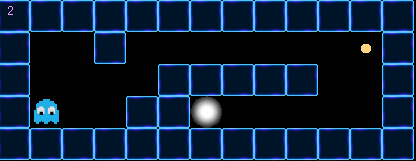

## So Long:

Link for game reference: https://itch.io/game-assets/free/tag-sprites

### Skills developed in this project:

- window management, 
- event handling, 
- colors
- textures


### External packages accepted:

- MiniLibX

https://github.com/42Paris/minilibx-linux

This library was
developed internally and includes basic necessary tools to open a window, create images
and deal with keyboard and mouse events.


### Instructions to develop:

Only can use the following functions:
open, close, read, write, malloc, free, perror, strerror, exit

### Maps

The map must be in format *.ber

-  The map must be rectangular.
- If any misconfiguration of any kind is encountered in the file, the program must
  exit in a clean way, and return "Error\n"
- The map can be composed of only these 5 characters:
```
 0 for an empty space, 
 1 for a wall,
 C for a collectible,
 E for a map exit,
 P for the player’s starting position.
```

Map format example:

    1111111111111
    10010000000C1
    1000011111001
    1P0011E000001
    1111111111111


Image Game



### Tasks:

- [X] Press ESC must close window
- [X] Close windows when click in X of window
- [ ] Resize windows management must remain smooth
- [ ] Every movement must be displayed in the shell

- [X] Use of images of the miniLibX is mandatory

- [X] Movement up, down, left, right

- [X] Need collect every collectible present
- [X] Player can't be able to move into walls
- [X] If map contains a duplicate character exit/start you should display an error message
- [ ] if map contains broken walls
- [ ] Algorithm to valid correct path from Player to exit, wall can't block the path